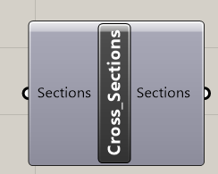
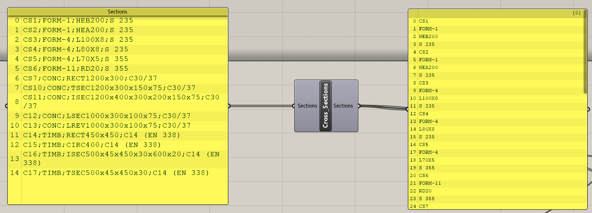
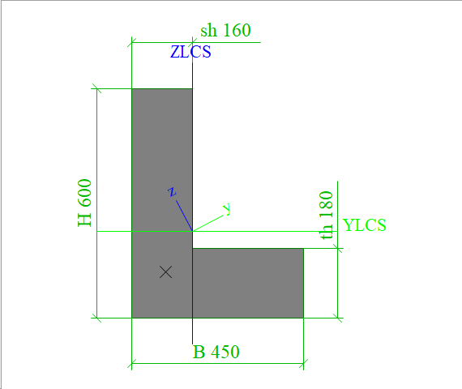
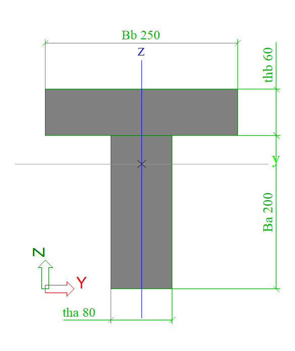

# Cross-sections

Cross-section component defines all possible cross-sections which you can the use for creation of beam through  beam component.



## Inputs

As an input, you have to define text field with input parameters. It is possible to define steel rolled cross-section from SCIA Engineer cross-section catalogue, concrete parametric cross-section and timber parametric cross-section.

### Syntax for steel rolled sections

_NameofYourCrossSection_; _Formcode_; _ReferenceName_; _Material_

where:

* _NameofYourCrossSection_ is how you name your cross-section. This name is used during definition of beam.
* _Formcode_: FORM-X, where "X" is the so called formcode, which you can find [here](https://help.scia.net/webhelplatest/en/#steel/code_checks__inc._fire_resistance_/tb_steel_uls/annexes/annex_a_profile_library_formcodes.htm).

### Syntax for concrete and timber sections: 

_NameofYourCrossSection_; _MatCode_; _TypeParameters_; _MaterialGrade_

where

* _NameofYourCrossSection_ is how you name your cross-section. This name is used during definition of beam.
* _MatCode_
  * concrete: CONC
  * timber: TIMB
* _TypeParameters_ is definition of type and parameters
  * concrete the following  shapes are supported

    * Rectangle RECTH**x**B  ****

      

    * I section ISECH**x**Bh**x**Bs**x**ts**x**th**x**s

           

    * L section LSECH**x**B**x**th**x**sh

           

    * Reverse L section LREVH**x**B**x**th**x**sh

           

    * T section TSECH**x**B**x**th**x**sh 

          

    * Circle CIRCD

         

    * Oval OVALH**x**B

 

          

 

  * Timber

    * Rectangle RECTH**x**B
    * I section ISECBa**x**tha**x**Bb**x**thb**x**Bc**x**thc

         

    * T section TSECBa**x**tha**x**Bb**x**thb

          

    * Circle CIRCD
* MaterialGrade - Material: the naming needs to be identical with a material in the SCIA Engineer project database \(S 235 or C25/30\)

## Outputs

As output from component there is string list with defined cross-sections and its properties which needs to be linked to component for creation of XML file.



