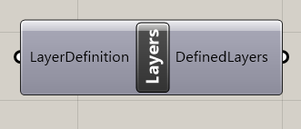
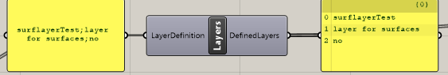

# Layers

Layers component defines layers which then can be used for definition of layers for beams and 2D members. 

## Inputs

Layerdefiniton can contain list of strings for definition of layers. You should use following format _LayerName_;_Layerdescription_;_IsLayerStructuralOnly_

where

* _LayerName_  is name of the layer which is the used as input parameter for elements which supports of their assignments to layers. Layer name is the used as reference in the case of input parameters for other components.
* _Layerdescription_ is description of the layer
* _IsLayerStructuralOnly_ is parameter which sets layer to StructuralOnly. If elements are in structural layer in SCIA Engineer then they are omitted from FE calculation.

### Outputs

List with definition of the layers. This output have to be connected to the CreateXML component input parameter Layers.



