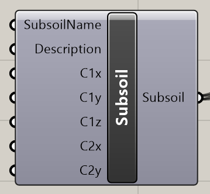

# Subsoil

Defines subsoil parameters which are the used for surface support.

## Inputs

### SubsoilName

Name of the created subsoil

### Description

Description of the subsoil

### C1x

Resistance of environment against tangent displacement dux \(mm\) \[C1x in MN/m3\]

### C1y

Resistance of environment against tangent displacement duy \(mm\) \[C1y in MN/m3\]

### C1z

Resistance of environment against normal displacement uz \(mm\) \[C1z in MN/m3\]

### C2x

Resistance of environment against rotation duz/dx \(mm/m or mrad\) \[C2x in MN/m\]

### C2y

Resistance of environment against rotation duz/dy \(mm/m or mrad\) \[C2y in MN/m\]

## Outputs‌ 

Output is list with defined surface supports which needs to be connected to the CreateXML component and parameter Subsoils.



## Example

You can see this component in the action in example 2DmemberwithOpening.



