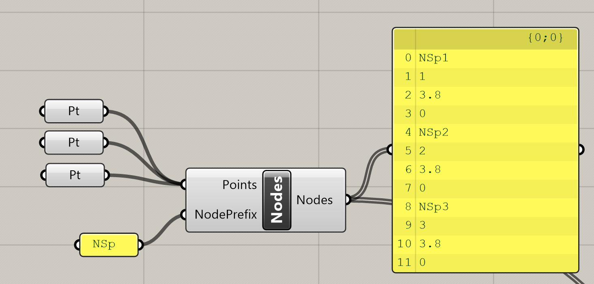

# Nodes

## Input

### Points

As input list of Grasshopper/Rhino geometrical nodes should be used.

### NodePrefix

Prefix which is used in the naming of generated nodes. Numbering starts from 1. So if prefix is N the the first node is N1 and so one. Default value is N. These names are the used as references in the case of input parameters for other components.

## Output

As output from component there is string list with defined nodes List needs to be linked to component for creation of XML file into Nodes input parameter and Beams input parameter.



## Example

You can see this component in the action in example 2DmemberwithOpening.



