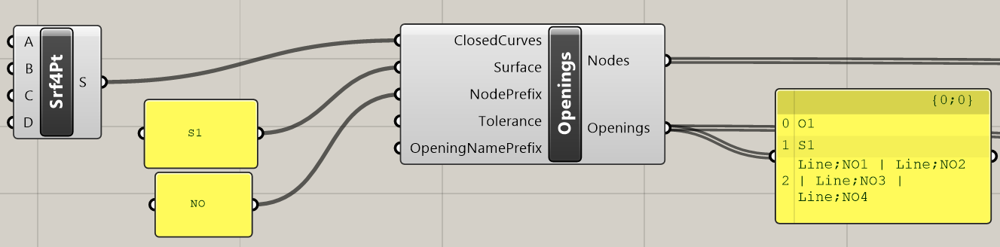

# Openings

## Input

### ClosedCurves

### Surface

### NodePrefix

### Tolerance

### OpeningNamePrefix

## Output

As output from component there is string list with defined nodes and string list with defined openings and their properties. Both lists need to be linked to component for creation of XML file into Nodes input parameter and Openings input parameter.



## Example

You can see this component in the action in example 2DmemberwithOpening.



