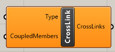

# Cross-link

Defines crosslink of two components

## Inputs

### Type

Type of the crosslink. It could be 

* Fixed
* Hinged

### Coupled members

Members where crosslink should be applied. Crosslink will be located in the intersection of the members, so members have to have an intersection. Syntax is firstmember;secondmember;.

## Output

Output is list with defined cross-links which needs to be connected to the CreateXML component and parameter CrossLinks.



