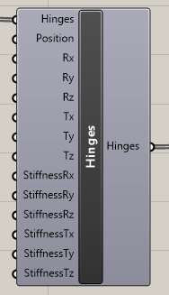

# Hinges

## Input

### Hinges

List of beams with their names where hinges should be applied

### Positions

Definition of the position of the hinges. Hinges could be on

* Begin
* End
* Both

### Rx

Defines type of support of degree of freedom for rotation around global x axis. It could be

* Free
* Rigid
* Flexible - once you use this option the you need to define StiffnessRx parameter

### Ry

Defines type of support of degree of freedom for rotation around global y axis. It could be

* Free
* Rigid
* Flexible - once you use this option the you need to define StiffnessRy parameter

### Rz

Defines type of support of degree of freedom for rotation around global z axis. It could be

* Free
* Rigid
* Flexible - once you use this option the you need to define StiffnessRz parameter

## Tx

Defines type of support of degree of freedom for translation in global x axis. It could be

* Free
* Rigid
* Flexible - once you use this option the you need to define StiffnessTx parameter
* Rigid press only
* Rigid tension only
* Flexible press only - once you use this option the you need to define StiffnessTx parameter
* Flexible tension only - once you use this option the you need to define StiffnessTx parameter

### **Ty**

Defines type of support of degree of freedom for translation in global y axis. It could be

* Free
* Rigid
* Flexible - once you use this option the you need to define StiffnessTy parameter
* Rigid press only
* Rigid tension only
* Flexible press only - once you use this option the you need to define StiffnessTy parameter
* Flexible tension only - once you use this option the you need to define StiffnessTy parameter

## Tz

Defines type of support of degree of freedom for translation in global z axis. It could be

* Free
* Rigid
* Flexible - once you use this option the you need to define StiffnessRz parameter
* Rigid press only
* Rigid tension only
* Flexible press only - once you use this option the you need to define StiffnessTz parameter
* Flexible tension only - once you use this option the you need to define StiffnessTz parameter

## Output

Output is list with defined hinges which needs to be connected to the CreateXML component and parameter Hinges.

## Example

You can see this component in the action in example Example\_Truss3D.



