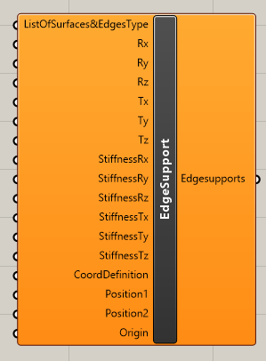

# Line support on 2D member edge

Component EdgeSupport defines line supports on the edge of 2D member or opening.

## Inputs

### ListOfSurafces&Edgetype

Contains list of surfaces, edges types and their numbers. Syntax is _2DmemberName;2Dmembertype;EdgeNumber_ where

* _2DmemberName_ is name of the 2D member where supports should be applied
* _2Dmembertype_ is type of 2D member 
  * SURFACE - will be applied on 2D member
  * OPENING - will be applied on opening in 2D member
* _EdgeNumber_  is number of the edge of 2D member

e.g. S1;SURFACE;1 - support is applied on 2D member with name S1 on the first edge.

### Rx 

‌Defines type of support of degree of freedom for rotation around global x axis. It could be‌

* Free
* Rigid
* Flexible - once you use this option the you need to define StiffnessRx parameter

### ‌Ry

‌Defines type of support of degree of freedom for rotation around global y axis. It could be‌

* Free
* Rigid
* Flexible - once you use this option the you need to define StiffnessRy parameter

### ‌Rz

‌Defines type of support of degree of freedom for rotation around global z axis. It could be‌

* Free
* Rigid
* Flexible - once you use this option the you need to define StiffnessRz parameter

### ‌Tx

‌Defines type of support of degree of freedom for translation in global x axis. It could be‌

* Free
* Rigid
* Flexible - once you use this option the you need to define StiffnessTx parameter
* Rigid press only
* Rigid tension only
* Flexible press only - once you use this option the you need to define StiffnessTx parameter
* Flexible tension only - once you use this option the you need to define StiffnessTx parameter

### **Ty** 

‌Defines type of support of degree of freedom for translation in global y axis. It could be‌

* Free
* Rigid
* Flexible - once you use this option the you need to define StiffnessTy parameter
* Rigid press only
* Rigid tension only
* Flexible press only - once you use this option the you need to define StiffnessTy parameter
* Flexible tension only - once you use this option the you need to define StiffnessTy parameter

### ‌Tz

‌Defines type of support of degree of freedom for translation in global z axis. It could be‌

* Free
* Rigid
* Flexible - once you use this option the you need to define StiffnessRz parameter
* Rigid press only
* Rigid tension only
* Flexible press only - once you use this option the you need to define StiffnessTz parameter
* Flexible tension only - once you use this option the you need to define StiffnessTz parameter

### CoordDefinition

Definition if coordinate is absolute or relative.  Relative definition is in interval from 0 to 1. Absolute is absolute coordinate on the beam with the respect to the global coordinate system. You can right click on parameter as select the type or input value below

* Rela - 0
* Abso - 1

### Position1

Definition of the start of the placement of the line support.

### Position 2

Definition of the end of the placement of the line support.

### Origin

Definition of the origin of the coordinate system location. You can choose if Position1 is the nearest to start or end of the beam. You can right click on parameter as select the type or input value below

* From start
* From end

## Outputs‌ 

Output is list with defined line supports which needs to be connected to the CreateXML component and parameter EdgeSupports.



## Example

You can see this component in the action in example 2DmemberwithOpening.



