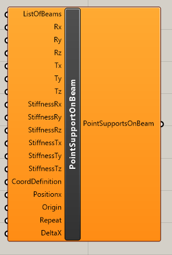

# Point support on beam

  
PointSupportOnBeam component defines nodal  supports on beam.

## Inputs‌ 

### ListOfBeams 

‌As input you define list of beams where supports will be applied. List have to contain at least one beam with its name. Beams have to be created with beam component.



### Rx 

‌Defines type of support of degree of freedom for rotation around global x axis. It could be‌

* Free
* Rigid
* Flexible - once you use this option the you need to define StiffnessRx parameter

### ‌Ry

‌Defines type of support of degree of freedom for rotation around global y axis. It could be‌

* Free
* Rigid
* Flexible - once you use this option the you need to define StiffnessRy parameter

### ‌Rz

‌Defines type of support of degree of freedom for rotation around global z axis. It could be‌

* Free
* Rigid
* Flexible - once you use this option the you need to define StiffnessRz parameter

### ‌Tx

‌Defines type of support of degree of freedom for translation in global x axis. It could be‌

* Free
* Rigid
* Flexible - once you use this option the you need to define StiffnessTx parameter
* Rigid press only
* Rigid tension only
* Flexible press only - once you use this option the you need to define StiffnessTx parameter
* Flexible tension only - once you use this option the you need to define StiffnessTx parameter

### **Ty** 

‌Defines type of support of degree of freedom for translation in global y axis. It could be‌

* Free
* Rigid
* Flexible - once you use this option the you need to define StiffnessTy parameter
* Rigid press only
* Rigid tension only
* Flexible press only - once you use this option the you need to define StiffnessTy parameter
* Flexible tension only - once you use this option the you need to define StiffnessTy parameter

### ‌Tz

‌Defines type of support of degree of freedom for translation in global z axis. It could be‌

* Free
* Rigid
* Flexible - once you use this option the you need to define StiffnessRz parameter
* Rigid press only
* Rigid tension only
* Flexible press only - once you use this option the you need to define StiffnessTz parameter
* Flexible tension only - once you use this option the you need to define StiffnessTz parameter

### CoordDefinition

Definition if coordinate is absolute or relative.  Relative definition is in interval from 0 to 1. Absolute is absolute coordinate on the beam with the respect to the global coordinate system. You can right click on parameter as select the type or input value below

* Rela - 0
* Abso - 1

### PositionX

Definition of the placement of the nodal support.

### Origin

Definition of the origin of the coordinate system location. You can choose if PositionX is the nearest to start or end of the beam. You can right click on parameter as select the type or input value below

* From start
* From end

### Repeat

Defines if nodal support should be repeated on the beam. Default is 1 - no repeat.

### DeltaX

Definition of distance between repeated nodal support. Default is 0.1.

## Outputs‌ 

Output is list with defined nodal supports which needs to be connected to the CreateXML component and parameter PointSupportOnBeam.

## Example

You can see this component in the action in example Frame.



