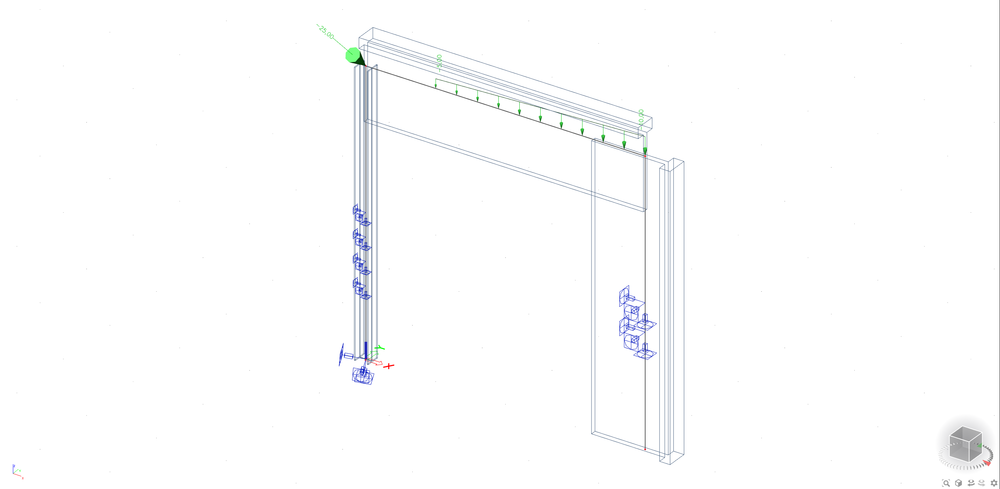

# Simple examples for easy start

## Example Frame

This example is located in the same folder/zip as \*.gha file. You can download it up to date from our Github storage [here](https://github.com/jarabroz/Koala/raw/master/ExampleFiles/Frame.gh).

## Example 2Dmember with opening

This example is located in the same folder/zip as \*.gha file. You can download it up to date from our Github storage [here](https://github.com/jarabroz/Koala/raw/master/ExampleFiles/2DMemberWithOpening.gh).

## ExampleTruss3D

This example is located in the same folder/zip as \*.gha file. You can download it up to date from our Github storage [here](https://github.com/jarabroz/Koala/raw/master/ExampleFiles/Example_Truss3D.gh).

## Voronoi example

This example is located in the same folder/zip as \*.gha file. You can download it up to date from our Github storage [here](https://github.com/jarabroz/Koala/raw/master/ExampleFiles/Example_Voronoi.gh).

## Example Load panel

This example is located in the same folder/zip as \*.gha file. You can download it up to date from our GitHub storage [here](https://github.com/jarabroz/Koala/raw/master/ExampleFiles/Loadpanels.gh).

